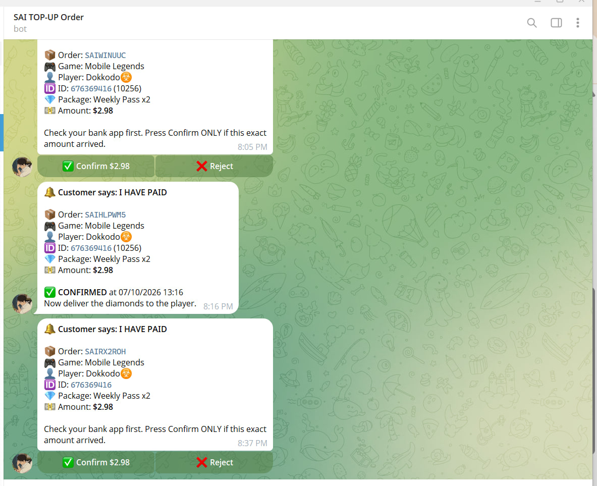

# 🎮 Sai Top-Up — Game Top-Up Store

A full-stack e-commerce web application for purchasing in-game top-up packages (credits, diamonds, UC, etc.) for popular mobile and PC games. Built with a modern **Laravel + Vue.js** monorepo architecture, integrated with **Telegram Bot API** for real-time payment confirmation, and fully containerized with **Docker** for easy setup and deployment.

---

## 📸 Screenshots & Demo

| Dark Mode (Hero Banner) | Light Mode (Hero Banner) |
| :---: | :---: |
|  |  |

| KHQR Payment Modal | Telegram Bot Real-time Confirmation |
| :---: | :---: |
|  |  |

---

## 📖 Introduction

**Sai Top-Up** is a personal full-stack project that simulates a real-world game top-up store (similar to Codashop or Smile One). Users can browse supported games, select a top-up package, enter their Player ID & Zone ID, and verify the in-game identity via real-time **Check Name** verification before completing the purchase.

The checkout flow is powered by **KHQR (Bakong)** payment demo. When a customer marks an order as paid, a **Telegram Bot** immediately notifies the administrator with inline interactive buttons (`Confirm` / `Reject`) to approve the payment directly from Telegram.

### Key Learning Objectives:
- Full-stack monorepo architecture (**Laravel 11 + Vue 3 / Vite**)
- RESTful API design & clean status lifecycle management
- External verification integration (In-game Player ID verification)
- **Telegram Bot Webhook & Polling** for administrative order approvals
- Responsive UI design with **Tailwind CSS** supporting both Dark/Light cyber themes
- Containerized development workflows using **Docker & Docker Compose**

---

## ✨ Features

- 🎮 **Game Catalog**: Browse popular supported games (Mobile Legends, Free Fire, Honor of Kings).
- 🆔 **Account Verification**: Instant in-game **Check Name** lookup for Game ID & Server ID.
- 💎 **Interactive Package Selection**: Clean denomination selector showing packages, passes, and prices.
- 💳 **KHQR Payment Modal**: Dynamic KHQR code generation with countdown timer and order code.
- 🤖 **Telegram Order Integration**: Automated notification sent to Telegram channel/group when a customer claims payment.
- ⚡ **Admin Telegram Polling**: Custom Artisan CLI command (`telegram:poll`) to handle `Confirm` / `Reject` callbacks in real-time.
- 🌓 **Theme Switcher**: Fully responsive UI supporting customizable dark and light cyberpunk aesthetics.
- 🐳 **Dockerized Setup**: Monorepo orchestration with Docker Compose (Nginx, PHP-FPM, MySQL, phpMyAdmin).

---

## 🛠️ Tech Stack

| Layer | Technology |
|---|---|
| **Backend** | Laravel 11 (PHP 8.2+) |
| **Frontend** | Vue 3, Vite, Tailwind CSS, Pinia |
| **Database** | MySQL / phpMyAdmin |
| **Integrations** | Telegram Bot API, KHQR (Bakong Demo) |
| **DevOps** | Docker, Docker Compose, Nginx |

---

## 📂 Project Structure

```text
sai-top-up/
├── backend/
│   ├── app/
│   │   ├── Console/Commands/   # Telegram polling commands (TelegramPoll.php)
│   │   ├── Http/Controllers/   # OrderController & API endpoints
│   │   ├── Models/             # Order and Game models
│   │   └── Services/           # Telegram notification service
│   ├── database/migrations/    # Orders and Game schema migrations
│   └── routes/api.php          # API routes
├── frontend/
│   ├── public/                 # Media assets (MLBB videos & hero renders)
│   └── src/views/Home.vue      # Main interactive store view
├── docs/screenshots/           # Readme preview images
├── nginx/                      # Reverse proxy configuration
├── docker-compose.yml          # Container stack orchestration
└── README.md


## 🔄 Order Lifecycle Flow

<p align="center">
  
</p>


🚀 Getting Started
Prerequisites
Docker Desktop & Docker Compose
Git
1. Clone the repository
git clone [https://github.com/virakbothchharn6-tech/sai-project-top-up.git](https://github.com/virakbothchharn6-tech/sai-project-top-up.git)
cd sai-project-top-up

2. Configure Environment Variables
cp backend/.env.example backend/.env

cp backend/.env.example backend/.env
Ensure your backend/.env has your Telegram Bot Token and Chat ID configured:
TELEGRAM_BOT_TOKEN=your_bot_token_here
TELEGRAM_CHAT_ID=your_chat_id_here
3. Build & Run Containers
docker compose up -d --build
4. Setup Backend & Database
docker compose exec app composer install
docker compose exec app php artisan key:generate
docker compose exec app php artisan migrate --seed
5. Run Telegram Polling (for order actions)
docker compose exec app php artisan telegram:poll
6. Access the Application
Frontend Web Store: http://localhost:5173
Backend API: http://localhost:8000/api
phpMyAdmin: http://localhost:8080

📌 Roadmap
[x] Game Catalog & Top-Up Packages UI
[x] Player ID / Zone ID Check Name verification
[x] KHQR Payment modal demo
[x] Telegram Bot integration (Order alerts & approval polling)
[x] Mobile Legends Hero Banner with dynamic theme switching
[ ] ABA PayWay direct gateway integration
[ ] Admin Web Dashboard for manual order fulfillment
[ ] User authentication & order history lookup

📄 License
This project is open-source and created for educational and portfolio demonstration purposes.


